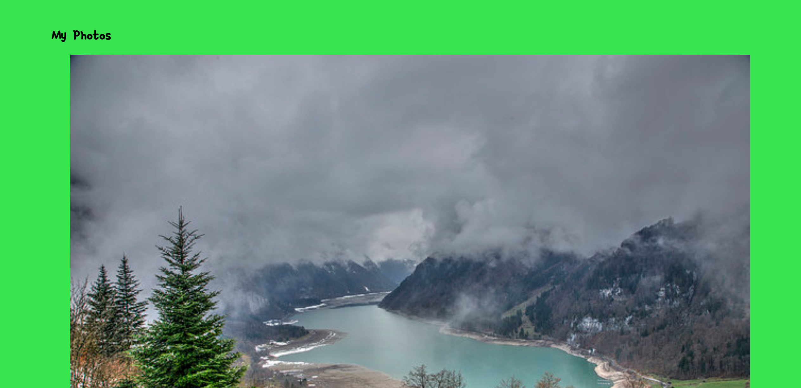
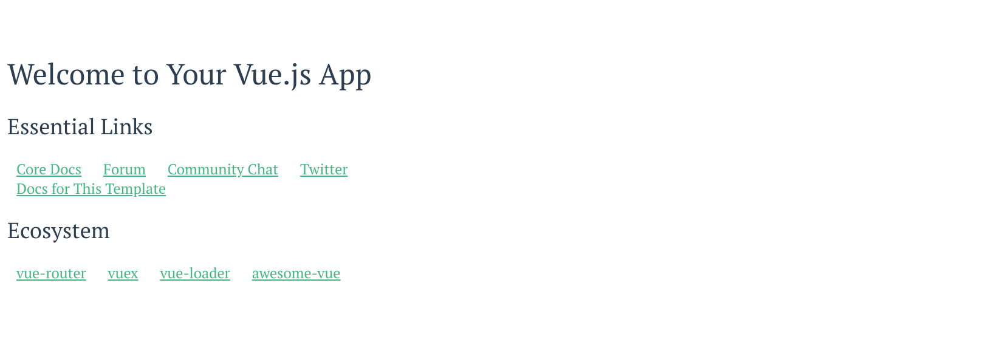

# Final Exam Winter 2018

This is the final exam for CS 260 Winter 2018.

To take this exam, you will time yourself for three hours. You may stop the timer if you need to
take a short bathroom or snack break. If an emergency occurs, please stop the timer and contact me
once you've handled the emergency.

You may take this exam on any computer you are comfortable with and in any location you prefer. The
exam is open note and open Internet. You can use any online material. You can use code I have
written and code you have written. The only restrictions are that you may not talk to others about
the exam, you may not get help from another person, and you may not copy solutions directly from
sites that provide an exact solution to the problems I give you (e.g. a Stack Overflow solution).

# Starting the final exam

To start the final exam, you must follow this GitHub Classroom link. This will create a private
repository for you using our classroom site. We will only grade repositories created and submitted
this way.

Once you "Accept the assignment" on GitHub Classroom, it will create a new repository for you and
grant you access to it on GitHub. In order to start working on the lab, simply clone the repository
to your laptop or other working environment.

# Code in this exam

There are two directories with code in this exam: `myphotos` and `blogorama`. Be sure you
are using node. For example, if you used nvm to setup node, then:

```
nvm use stable
```

## My Photos

The My Photos app is a simple application for displaying a set of photos. To run this code, you
will need to install dependencies:

```
cd myphotos
npm install
```

Then you can start the application:

```
node server.js
```

You can visit the app in your browser at `localhost:8080`.

Node will serve files from the `public` directory. This application has HTML in `index.html`, CSS in
`styles.css`, and JavaScript using Vue in `script.js`. The server uses Node, Express, and knex. Data
is stord in a SQLite database called db.sqlite3. The database is already configured for you in
`knexfile.js`. I have already run the migration listed in `migrations`. I have also put some data in
the database.

When you start My Photos for the first time, it will *not* be using the database. It will display a set
of photos that are hard-coded into the application. It should look like this:



## Blog-o-rama

The Blog-o-rama app is a simple blogging application. It is so simple that all it does is display a
set of blog entries. To run this code, you will need to install dependencies:

```
cd blogorama
npm install
```

Then you can start the application. In one terminal, start the front end:

```
npm run dev
```

In another terminal, start the back end:

```
node server.js
```

You can visit the app in your browser at `localhost:8080`.

This is a Vue project using the webpack template. The front-end source code is in `src`. The back
end source code is in `server.js`.  The front end code is incomplete. It has a working store in
`src/store.js` that uses axios to call the back end. However, the front end is still configured to
use the default Hello World component and will not display the blog. The back end is completely
written for you. It uses Node, Express, and knex. Data is stored in a SQLite database called
db.sqlite3. The database is already configured for you in `knexfile.js`. I have already run the
migrations. I have also put some data in the database using the script in `data/addPosts.js`. You
will not need to run this script or modify the back end in any way.

When you start Blog-o-rama for the first time, it will *not* show the blog entries. It will display
the default template page instead. It should look like this:



# Problem 1: My Photos

Modify the My Photos HTML and CSS to improve the design of the page.

* You should pick a color scheme from `color.adobe.com` or some other site. Document which color
scheme you use by leaving a comment at the top of `styles.css`.

* Follow the design principles we learned to develop a usable site. You may modify `index.html` and
`styles.css` as needed.

This problem is worth 25 points. Grading will be based on this rubric:

Item | Points
---- | ------
Spacing | 5 points
Typography | 5 points
Color | 5 points
Consistency | 5 points
Creativity | 5 points

# Problem 2: My Photos

Modify the My Photos application so that it fetches photos from the server.

* As currently written, the application uses photos that are hard-coded. Modify `script.js` so that
it instead fetches photos from the server.

* Use the axios library, which is already loaded in `index.html`. You will need to examine `server.js`
to find the REST endpoint. Do not hardcode a hostname or port.

This problem is worth 25 points. Grading will be based the following rubric:

Item | Points
---- | ------
Pictures are loaded from the database reliably | 25 points
Most of this working | 20 points
Some of this working | 10 points

# Problem 3: My Photos

In the My Photos application, add a description for photos in the database.

* Write a migration to add a string column called `description` to the photos table in the database
  and run this migration.

* After you run the migration, run a script I have provided to update the photos in the database so
that they include a description: `node data/addPhotos.js`.

* Modify the front end to show this description.

* Ensure that you use good design principles for the front end.

This problem is worth 50 points. Grading will be based the following rubric:

Item | Points
---- | ------
Pictures with a description are loaded from the database reliably, with good design | 50 points
Most of this working | 40 points
Some of this working | 25 points

# Problem 4: My Photos

Modify the My Photos application to allow viewing one photo at a time.

* Write a new REST API endpoint to fetch one picture.

* Modify the front end so if you click on a picture, it shows just that picture.

* When showing just one picture, include a link for the user to go back to viewing all pictures.

* You should do this with just one page, `index.html`, and switch between the two views using Vue.

This problem is worth 50 points. Grading will be based the following rubric:

Item | Points
---- | ------
Can switch between one picture and all pictures and uses new REST API endpoint | 50 points
Most of this working | 40 points
Some of this working | 25 points

# Problem 5: Blog-o-rama

Modify the Blog-o-rama application to show the blog posts on the front page.

* Add a component and change the router to use this component.

* Install and use the [moment](http://momentjs.com/) library to display the date using
  `moment(date).format('MMMM Do YYYY, h:mm a');`

* Follow the design principles we learned to develop a usable site. Local styles can be placed
  in your new component. For site-wide styles you may need to modify `src/App.vue`.

This problem is worth 50 points. Grading will be based the following rubric:

Item | Points
---- | ------
Displays all of the blog entries, using moment correctly, and has a good design | 50 points
Most of this working or a poor design | 40 points
Some of this working | 25 points
